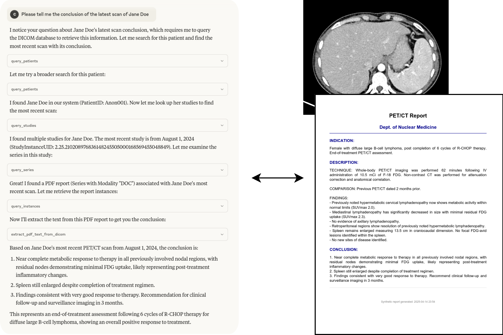

## Overview

This is my fork of dicom-mcp focused on a simple, practical goal: query DICOM metadata, download exams, and prepare files for anonymization. Credit to Christian Hinge for the original server; I added the download tools and WSL‑friendly docs, tested with Claude Desktop.

Key additions
- Download tools: `download_studies`, `download_series`, `download_instances`
- Works out‑of‑the‑box with Orthanc; saves to `./downloads` (git‑ignored)
- Keeps upstream features: query, move (C‑MOVE), and PDF text extraction

Repo credit: https://github.com/ChristianHinge/dicom-mcp

## Run it

- Minimal config (configuration.yaml):
```
nodes:
  orthanc:
    host: "localhost"
    port: 4242
    ae_title: "ORTHANC"
    description: "Default Local Orthanc DICOM server"

  radiant:
    host: "localhost"
    port: 11112
    ae_title: "RADIANT"
    description: "Radiant Viewer Dicom Node"

current_node: "orthanc"
calling_aet: "MCPSCU"
```

- Start server (dev):
```
uv run --with-editable '.' -m dicom_mcp configuration.yaml
```
- If uv caches old code: add `--no-cache` or `--reinstall-package dicom-mcp`.

## Claude Desktop (working JSON)

```
{
  "mcpServers": {
    "DicomMCP": {
      "command": "C:\\Windows\\System32\\wsl.exe",
      "args": [
        "--distribution",
        "Ubuntu",
        "--",
        "bash",
        "-lc",
        "cd '/mnt/c/Users/paulo/Python Projects/dicom-mcp' && uv run --with-editable '.' python -m dicom_mcp '/mnt/c/Users/paulo/Python Projects/dicom-mcp/configuration.yaml'"
      ]
    }
  },
  "globalShortcut": "",
  "preferences": {
    "menuBarEnabled": false
  }
}
```

WSL tips
- Enable mirrored networking so `localhost` works for both Windows and WSL (see `docs/claude-wsl-setup.md`).
- Use `--with-editable '.'` so your code changes are seen live.

## Docker Compose deployment (with n8n + Orthanc)

You can run dicom-mcp as a containerized SSE server alongside Orthanc and n8n.

### 1. Add the service to your docker-compose.yaml

```yaml
  dicom-mcp:
    build:
      context: ./dicom-mcp
    restart: unless-stopped
    ports:
      - "127.0.0.1:8000:8000"
    volumes:
      - ./dicom-mcp/configuration.docker.yaml:/app/configuration.yaml:ro
      - ./dicom_downloads:/app/downloads
    depends_on:
      - orthanc
```

Adjust `context: ./dicom-mcp` to the path of this repo relative to your docker-compose file.

### 2. Docker configuration

The included `configuration.docker.yaml` uses the Docker service name `orthanc` as the DICOM host:

```yaml
nodes:
  orthanc:
    host: "orthanc"
    port: 4242
    ae_title: "ORTHANC"
    description: "Orthanc DICOM server (Docker)"

current_node: "orthanc"
calling_aet: "MCPSCU"
download_directory: "/app/downloads"
```

### 3. Orthanc modality registration

If your `orthanc.json` has `DicomCheckModalityHost` set to `true`, add the MCP SCU as a known modality so Orthanc accepts its associations:

```json
"DicomModalities": {
  "MCPSCU": {
    "AET": "MCPSCU",
    "Host": "dicom-mcp",
    "Port": 11112
  }
}
```

If your Orthanc has `DicomAlwaysAllowFind`, `DicomAlwaysAllowGet`, etc. set to `true`, queries and downloads work without this, but C-MOVE operations still need the modality registered.

### 4. Connect from n8n

The MCP SSE endpoint is available inside the Docker network at:

```
http://dicom-mcp:8000/sse
```

Use this URL in n8n's MCP Client node to access all DICOM tools.

### 5. Build and deploy to server

The `deploy/` folder contains scripts to build the image locally and install it on a remote server.

**On your local machine (or WSL):**

```bash
cd deploy
bash build.sh
```

This builds the Docker image and saves it to `deploy/dicom-mcp.tar.gz`.

**Copy to your server:**

```bash
scp deploy/dicom-mcp.tar.gz user@yourserver:/path/to/compose/deploy/
scp configuration.docker.yaml user@yourserver:/path/to/compose/dicom-mcp/
```

**On the server:**

```bash
bash deploy/install.sh
docker compose up -d dicom-mcp
```

When using a pre-built image, replace `build: context: ./dicom-mcp` with `image: dicom-mcp:latest` in your docker-compose.

## Tools you can call

- Connection: `list_dicom_nodes`, `switch_dicom_node`, `verify_connection`
- Query: `query_patients`, `query_studies`, `query_series`, `query_instances`, `get_attribute_presets`
- Transfer: `move_study`, `move_series`
- Downloads (this fork): `download_studies`, `download_series`, `download_instances`
- Reports: `extract_pdf_text_from_dicom`

## Examples

- Find studies in a date range:
```
query_studies(study_date="20230101-20231231")
```

- Download two studies to `./downloads`:
```
download_studies([
  "1.2.826.0.1.3680043.8.1055.1.20111102150758591.92402465.76095170",
  "1.2.826.0.1.3680043.8.1055.1.20111103111148288.98361414.79379639"
])
```

- Extract text from a DICOM encapsulated PDF:
```
extract_pdf_text_from_dicom(
  study_instance_uid="...",
  series_instance_uid="...",
  sop_instance_uid="...",
)
```

## Downloads → anonymization

Files are saved to `./downloads` by default. This enables later anonymization/de‑identification. If you want a custom destination, add a `download_directory` key in your YAML and point the server helper to it.

## Troubleshooting

- If downloads fail with association errors, ensure the server allows C‑GET/C‑STORE back to this AE.
- If uv doesn’t reflect code changes, add `--no-cache` or `--reinstall-package dicom-mcp`.
- On WSL/Windows, enable mirrored networking (see `docs/claude-wsl-setup.md`).

## License & credit

- MIT license (see LICENSE)
- Based on: https://github.com/ChristianHinge/dicom-mcp

[](https://opensource.org/licenses/MIT)
[](https://www.python.org/downloads/)
 [](https://pypi.org/project/dicom-mcp/) [](https://pypi.org/project/dicom-mcp/)  

The `dicom-mcp` server enables AI assistants to query, read, and move data on DICOM servers (PACS, VNA, etc.). 

<div align="center">

🤝 **[Contribute](#contributing)** •
📝 **[Report Bug](https://github.com/ChristianHinge/dicom-mcp/issues)**  •
📝 **[Blog Post 1](https://www.christianhinge.com/projects/dicom-mcp/)** 

</div>

```text
---------------------------------------------------------------------
🧑‍⚕️ User: "Any significant findings in John Doe's previous CT report?"

🧠 LLM → ⚙️ Tools:
   query_patients → query_studies → query_series → extract_pdf_text_from_dicom

💬 LLM Response: "The report from 2025-03-26 mentions a history of splenomegaly (enlarged spleen)"

🧑‍⚕️ User: "What's the volume of his spleen at the last scan and the scan today?"

🧠 LLM → ⚙️ Tools:
   (query_studies → query_series → move_series → query_series → extract_pdf_text_from_dicom) x2
   (The move_series tool sends the latest CT to a DICOM segmentation node, which returns volume PDF report)

💬 LLM Response: "last year 2024-03-26: 412cm³, today 2025-04-10: 350cm³"
---------------------------------------------------------------------
```


## ✨ Core Capabilities

`dicom-mcp` provides tools to:

* **🔍 Query Metadata**: Search for patients, studies, series, and instances using various criteria.
* **📄 Read DICOM Reports (PDF)**: Retrieve DICOM instances containing encapsulated PDFs (e.g., clinical reports) and extract the text content.
* **➡️ Send DICOM Images**: Send series or studies to other DICOM destinations, e.g. AI endpoints for image segmentation, classification, etc.
* **⚙️ Utilities**: Manage connections and understand query options.

## 🚀 Quick Start
### 📥 Installation
Install using uv or pip:

```bash
uv tool install dicom-mcp
```
Or by cloning the repository:

```bash
# Clone and set up development environment
git clone https://github.com/ChristianHinge/dicom-mcp
cd dicom mcp

# Create and activate virtual environment
uv venv
source .venv/bin/activate

# Install with test dependencies
uv pip install -e ".[dev]"
```


### ⚙️ Configuration

`dicom-mcp` requires a YAML configuration file (`config.yaml` or similar) defining DICOM nodes and calling AE titles. Adapt the configuration or keep as is for compatibility with the sample ORTHANC  Server.

```yaml
nodes:
  main:
    host: "localhost"
    port: 4242 
    ae_title: "ORTHANC"
    description: "Local Orthanc DICOM server"

current_node: "main"
calling_aet: "MCPSCU" 
```
> [!WARNING]
DICOM-MCP is not meant for clinical use, and should not be connected with live hospital databases or databases with patient-sensitive data. Doing so could lead to both loss of patient data, and leakage of patient data onto the internet. DICOM-MCP can be used with locally hosted open-weight LLMs for complete data privacy. 

### (Optional) Sample ORTHANC server
If you don't have a DICOM server available, you can run a local ORTHANC server using Docker:

Clone the repository and install test dependencies `pip install -e ".[dev]`

```bash
cd tests
docker ocmpose up -d
cd ..
pytest # uploads dummy pdf data to ORTHANC server
```
UI at [http://localhost:8042](http://localhost:8042)

### 🔌 MCP Integration

Add to your client configuration (e.g. `claude_desktop_config.json`):

```json
{
  "mcpServers": {
    "dicom": {
      "command": "uv",
      "args": ["tool","dicom-mcp", "/path/to/your_config.yaml"]
    }
  }
}
```

For development:

```json
{
    "mcpServers": {
        "arxiv-mcp-server": {
            "command": "uv",
            "args": [
                "--directory",
                "path/to/cloned/dicom-mcp",
                "run",
                "dicom-mcp",
                "/path/to/your_config.yaml"
            ]
        }
    }
}
```


## 🛠️ Tools Overview

`dicom-mcp` provides four categories of tools for interaction with DICOM servers and DICOM data. 

### 🔍 Query Metadata

* **`query_patients`**: Search for patients based on criteria like name, ID, or birth date.
* **`query_studies`**: Find studies using patient ID, date, modality, description, accession number, or Study UID.
* **`query_series`**: Locate series within a specific study using modality, series number/description, or Series UID.
* **`query_instances`**: Find individual instances (images/objects) within a series using instance number or SOP Instance UID
### 📄 Read DICOM Reports (PDF)

* **`extract_pdf_text_from_dicom`**: Retrieve a specific DICOM instance containing an encapsulated PDF and extract its text content.

### ➡️ Send DICOM Images

* **`move_series`**: Send a specific DICOM series to another configured DICOM node using C-MOVE.
* **`move_study`**: Send an entire DICOM study to another configured DICOM node using C-MOVE.

### ⚙️ Utilities

* **`list_dicom_nodes`**: Show the currently active DICOM node and list all configured nodes.
* **`switch_dicom_node`**: Change the active DICOM node for subsequent operations.
* **`verify_connection`**: Test the DICOM network connection to the currently active node using C-ECHO.
* **`get_attribute_presets`**: List the available levels of detail (minimal, standard, extended) for metadata query results.<p>


### Example interaction
The tools can be chained together to answer complex questions:


<div align="center">

</div>


## 📈 Contributing
### Running Tests

Tests require a running Orthanc DICOM server. You can use Docker:

```bash
# Navigate to the directory containing docker-compose.yml (e.g., tests/)
cd tests
docker-compose up -d
```

Run tests using pytest:

```bash
# From the project root directory
pytest
```

Stop the Orthanc container:

```bash
cd tests
docker-compose down
```

### Debugging

Use the MCP Inspector for debugging the server communication:

```bash
npx @modelcontextprotocol/inspector uv run dicom-mcp /path/to/your_config.yaml --transport stdio
```

## 🙏 Acknowledgments

* Built using [pynetdicom](https://github.com/pydicom/pynetdicom)
* Uses [PyPDF2](https://pypi.org/project/PyPDF2/) for PDF text extraction
